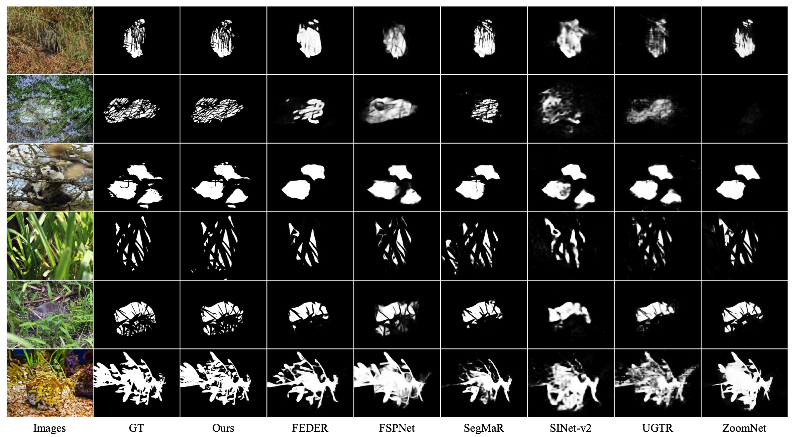

# ESCNet: Edge-Semantic Collaborative Network for Camouflaged Object Detection

This repository is the official implementation of **ESCNet: Edge-Semantic Collaborative Network for Camouflaged Object Detection**.

## Updates (Jul 2026)

We have refreshed the codebase with an improved implementation that **maintains segmentation quality while reducing inference overhead**. The re-trained checkpoints can been found at  https://github.com/suy9/ESCNet/releases, detail metrics are listed:


| Dataset   | S<sub>m</sub>↑ | wF<sub>β</sub>↑ | F<sub>β</sub>↑ | E<sub>φ</sub>↑ | MAE↓  |
|-----------|----------------|-----------------|----------------|----------------|-------|
| CHAMELEON | 0.906          | 0.875           | 0.886          | 0.959          | 0.022 |
| CAMO      | 0.874          | 0.848           | 0.868          | 0.941          | 0.041 |
| COD10K    | 0.873          | 0.807           | 0.827          | 0.941          | 0.020 |
| CHAMELEON | 0.890          | 0.859           | 0.876          | 0.942          | 0.029 |


## Visual Comparison

<div align="center">
  
  <br>
  <em>Visual comparison between ESCNet and other SOTA methods. Our model accurately segments objects with complex backgrounds and intricate boundaries.</em>
</div>

## Requirements

- python == 3.11
- cuda >= 12.4

```setup
pip install -r requirements.txt
```

## Dataset

[COD (Camouflaged Object Detection) Dataset](https://github.com/lartpang/awesome-segmentation-saliency-dataset#camouflaged-object-detection-cod)

Test sets should follow this layout (same as CAMO / COD10K / NC4K):

```
Test/CHAMELEON/
├── Image/       # .jpg
├── GT_Object/   # .png
└── GT_Edge/     # .png (optional, for training)
```

Set `test_dir` in `config.yaml` to the dataset you want to evaluate.

## Pre-trained Model

The recommended checkpoint:

```
checkpoints/escnet/epoch_120.pth
```

For quick evaluation with pre-computed predictions, you can also download our test data:

- [Google Drive](https://drive.google.com/uc?id=1QrQ4hGuqmHpHqabPpYvB1FbN7jci1phg&export=download)

## Training

```shell
torchrun -nproc_per_node=4 train.py --config config.yaml
```

## Evaluation

Change `test_dir` in `config.yaml` for each benchmark, then run:

```shell
# inference (all checkpoints in checkpoints/escnet/, or a single ckpt)
python test.py --config config.yaml --pred_root preds
python test.py --config config.yaml --ckpt checkpoints/escnet/epoch_120.pth --pred_root preds

# metrics
python eval.py --config config.yaml --pred_root preds --save_dir results
```

One-shot train + test + eval:

```shell
bash run.sh
# eval only (skip training)
bash run.sh --notrain
```

## Citation

```
@inproceedings{ye2025escnet,
  title={ESCNet: Edge-Semantic Collaborative Network for Camouflaged Object Detection},
  author={Ye, Sheng and Chen, Xin and Zhang, Yan and Lin, Xianming and Cao, Liujuan},
  booktitle={Proceedings of the IEEE/CVF International Conference on Computer Vision},
  pages={20053--20063},
  year={2025}
}
```
